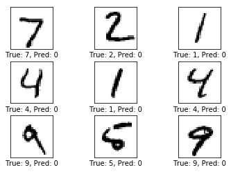
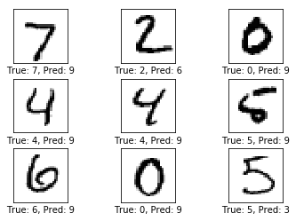
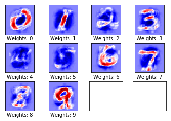
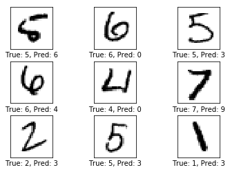
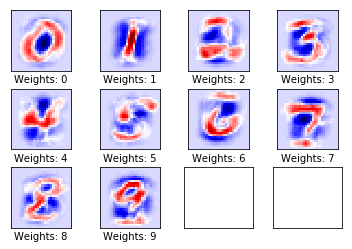
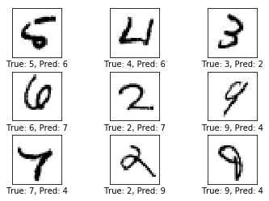
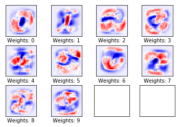
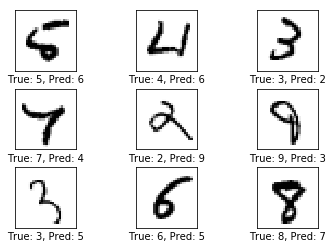
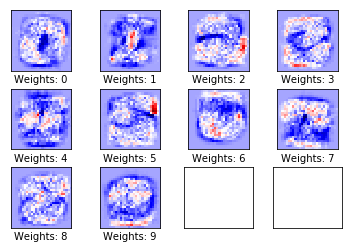
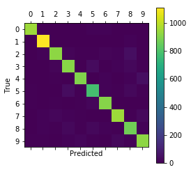

# Simple Linear Model - OCR
By Gaetano Bonofiglio, Veronica Iovinella

## Introduction
We'll start by developing a simple linear model for classification of handwritten digits (OCR) using MNIST data-set and then plot the results. This will later be compared with a Convolutional Neural Network for the same task.

## Imports
Helper functions are in [util.py](util.py).


```python
from IPython import get_ipython
get_ipython().run_line_magic('matplotlib', 'inline')
import tensorflow as tf
import numpy as np

from util import Util
u = Util()

tf.__version__
```


    '1.10.0'


## Data Load
The MNIST data-set is about 12 MB and will be downloaded automatically if it is not located in the given path.


```python
from tensorflow.examples.tutorials.mnist import input_data
data = input_data.read_data_sets("data/MNIST/", one_hot=True)
```

    WARNING:tensorflow:From <ipython-input-10-d748032e7ab8>:2: read_data_sets (from tensorflow.contrib.learn.python.learn.datasets.mnist) is deprecated and will be removed in a future version.
    Instructions for updating:
    Please use alternatives such as official/mnist/dataset.py from tensorflow/models.
    WARNING:tensorflow:From /Users/jacobjohn/anaconda3/lib/python3.6/site-packages/tensorflow/contrib/learn/python/learn/datasets/mnist.py:260: maybe_download (from tensorflow.contrib.learn.python.learn.datasets.base) is deprecated and will be removed in a future version.
    Instructions for updating:
    Please write your own downloading logic.
    WARNING:tensorflow:From /Users/jacobjohn/anaconda3/lib/python3.6/site-packages/tensorflow/contrib/learn/python/learn/datasets/mnist.py:262: extract_images (from tensorflow.contrib.learn.python.learn.datasets.mnist) is deprecated and will be removed in a future version.
    Instructions for updating:
    Please use tf.data to implement this functionality.
    Extracting data/MNIST/train-images-idx3-ubyte.gz
    WARNING:tensorflow:From /Users/jacobjohn/anaconda3/lib/python3.6/site-packages/tensorflow/contrib/learn/python/learn/datasets/mnist.py:267: extract_labels (from tensorflow.contrib.learn.python.learn.datasets.mnist) is deprecated and will be removed in a future version.
    Instructions for updating:
    Please use tf.data to implement this functionality.
    Extracting data/MNIST/train-labels-idx1-ubyte.gz
    WARNING:tensorflow:From /Users/jacobjohn/anaconda3/lib/python3.6/site-packages/tensorflow/contrib/learn/python/learn/datasets/mnist.py:110: dense_to_one_hot (from tensorflow.contrib.learn.python.learn.datasets.mnist) is deprecated and will be removed in a future version.
    Instructions for updating:
    Please use tf.one_hot on tensors.
    Extracting data/MNIST/t10k-images-idx3-ubyte.gz
    Extracting data/MNIST/t10k-labels-idx1-ubyte.gz
    WARNING:tensorflow:From /Users/jacobjohn/anaconda3/lib/python3.6/site-packages/tensorflow/contrib/learn/python/learn/datasets/mnist.py:290: DataSet.__init__ (from tensorflow.contrib.learn.python.learn.datasets.mnist) is deprecated and will be removed in a future version.
    Instructions for updating:
    Please use alternatives such as official/mnist/dataset.py from tensorflow/models.


The MNIST data-set has now been loaded and consists of 70.000 images and associated labels. The data-set is split into 3 mutually exclusive sub-sets.


```python
print("Size of")
print("- Training-set:\t\t{}".format(len(data.train.labels)))
print("- Test-set:\t\t{}".format(len(data.test.labels)))
print("- Validation-set:\t{}".format(len(data.validation.labels)))
```

    Size of
    - Training-set:		55000
    - Test-set:		10000
    - Validation-set:	5000


The data-set has been loaded as so-called One-Hot encoding. This means the labels have been converted from a single number to a vector whose length equals the number of possible classes. All elements of the vector are zero except for the $i$'th element which is one and means the class is $i$. For example:


```python
data.test.labels[0:1, :]
```


    array([[0., 0., 0., 0., 0., 0., 0., 1., 0., 0.]])


We also need the classes as single numbers for various comparisons and performance measures, so we convert the One-Hot encoded vectors to a single number by taking the index of the highest element. Note that the word 'class' is a keyword used in Python so we need to use the name 'cls' instead.


```python
data.test.cls = np.array([label.argmax() for label in data.test.labels])
# example
data.test.cls[0:1]
```


    array([7])


### Data dimensions
The data dimensions are used in several places in the source-code below. In computer programming it is generally best to use variables and constants rather than having to hard-code specific numbers every time that number is used. This means the numbers only have to be changed in one single place. Ideally these would be inferred from the data that has been read, but here we just write the numbers.


```python
# We know that MNIST images are 28 pixels in each dimension.
img_size = 28

# Images are stored in one-dimensional arrays of this length.
img_size_flat = img_size * img_size

# Tuple with height and width of images used to reshape arrays.
img_shape = (img_size, img_size)

# Number of classes, one class for each of 10 digits.
num_classes = 10
```

### Helper-function for plotting images
Function used to plot 9 images in a 3x3 grid, and writing the true and predicted classes below each image.


```python
def plot_images(images, cls_true, cls_pred=None): 
    u.plot_images(images=images, cls_true=cls_true, cls_pred=cls_pred, img_size=img_size, img_shape=img_shape)
```

### Some plotted images from the data set


```python
# Get the first images from the test-set.
images = data.test.images[0:9]

# Get the true classes for those images.
cls_true = data.test.cls[0:9]

# Plot the images and labels using our helper-function above.
plot_images(images=images, cls_true=cls_true)
```


## TensorFlow Graph
The entire purpose of TensorFlow is to have a so-called computational graph that can be executed much more efficiently than if the same calculations were to be performed directly in Python. TensorFlow can be more efficient than NumPy because TensorFlow knows the entire computation graph that must be executed, while NumPy only knows the computation of a single mathematical operation at a time.

TensorFlow can also automatically calculate the gradients that are needed to optimize the variables of the graph so as to make the model perform better. This is because the graph is a combination of simple mathematical expressions so the gradient of the entire graph can be calculated using the chain-rule for derivatives.

A TensorFlow graph consists of the following parts which will be detailed below:
- Placeholder variables used to change the input to the graph.
- Model variables that are going to be optimized so as to make the model perform better.
- The model which is essentially just a mathematical function that calculates some output given the input in the placeholder variables and the model variables.
- A cost measure that can be used to guide the optimization of the variables.
- An optimization method which updates the variables of the model.

### Placeholder variables
Placeholder variables serve as the input to the graph that we may change each time we execute the graph. We call this *feeding the placeholder variables* and it is demonstrated further below.
First we define the placeholder variable for the input images. This allows us to change the images that are input to the TensorFlow graph. This is a so-called $tensor$, which just means that it is a multi-dimensional vector or matrix. The data-type is set to float32 and the shape is set to [None, img_size_flat], where *None* means that the tensor may hold an arbitrary number of images with each image being a vector of length *img_size_flat*.


```python
x = tf.placeholder(tf.float32, [None, img_size_flat])
```

Next we have the placeholder variable for the true labels associated with the images that were input in the placeholder variable x. The shape of this placeholder variable is [None, num_classes] which means it may hold an arbitrary number of labels and each label is a vector of length num_classes which is 10 in this case.


```python
y_true = tf.placeholder(tf.float32, [None, num_classes])
```

Finally we have the placeholder variable for the true class of each image in the placeholder variable x. These are integers and the dimensionality of this placeholder variable is set to [None] which means the placeholder variable is a one-dimensional vector of arbitrary length.


```python
y_true_cls = tf.placeholder(tf.int64, [None])
```

### Variables to be optimized
Apart from the placeholder variables that were defined above and which serve as feeding input data into the model, there are also some model variables that must be changed by TensorFlow so as to make the model perform better on the training data.

The first variable that must be optimized is called *weights* and is defined here as a $TensorFlow$ variable that must be initialized with zeros and whose shape is [img_size_flat, num_classes], so it is a 2-dimensional $tensor$ (or *matrix*) with *img_size_flat* rows and *num_classes* columns.


```python
weights = tf.Variable(tf.zeros([img_size_flat, num_classes]))
```

The second variable that must be optimized is called *biases* and is defined as a 1-dimensional $tensor$ (or *vector*) of length *num_classes*.


```python
biases = tf.Variable(tf.zeros([num_classes]))
```

### Model
This simple model multiplies the images in the placeholder variable *x* with the *weights* and then adds the *biases*.

The result is a matrix of shape [num_images, num_classes] because *x* has shape [num_images, img_size_flat] and *weights* has shape [img_size_flat, num_classes], so the multiplication of those two matrices is a matrix with shape [num_images, num_classes] and then the *biases* vector is added to each row of that matrix.

The name *logits* is typical $TensorFlow$ terminology.


```python
logits = tf.matmul(x, weights) + biases
```

Now *logits* is a matrix with *num_images* rows and *num_classes* columns, where the element of the $i$'th row and $j$'th column is an estimate of how likely the $i$'th input image is to be of the $j$'th class.

However, these estimates are a bit rough and difficult to interpret because the numbers may be very small or large, so we want to normalize them so that each row of the *logits* matrix sums to 1, and each element is limited between 0 and 1. This is calculated using the so-called *softmax* function and the result is stored in *y_pred*.


```python
y_pred = tf.nn.softmax(logits)
```

The predicted class can be calculated from the *y_pred* matrix by taking the index of the largest element in each row.


```python
y_pred_cls = tf.argmax(y_pred, dimension=1)
```

    WARNING:tensorflow:From <ipython-input-24-1b869074280b>:1: calling argmax (from tensorflow.python.ops.math_ops) with dimension is deprecated and will be removed in a future version.
    Instructions for updating:
    Use the `axis` argument instead


### Cost-function to be optimized
To make the model better at classifying the input images, we must somehow change the variables for *weights* and *biases*. To do this we first need to know how well the model currently performs by comparing the predicted output of the model *y_pred* to the desired output *y_true*.

The **cross-entropy** is a performance measure used in classification. The cross-entropy is a continuous function that is always positive and if the predicted output of the model exactly matches the desired output then the cross-entropy equals zero. The goal of optimization is therefore to minimize the cross-entropy so it gets as close to zero as possible by changing the weights and biases of the model.

$TensorFlow$ has a built-in function for calculating the cross-entropy. Note that it uses the values of the *logits* because it also calculates the *softmax* internally.


```python
cross_entropy = tf.nn.softmax_cross_entropy_with_logits(logits=logits, labels=y_true)
```

    WARNING:tensorflow:From <ipython-input-25-16a96512157d>:1: softmax_cross_entropy_with_logits (from tensorflow.python.ops.nn_ops) is deprecated and will be removed in a future version.
    Instructions for updating:
    
    Future major versions of TensorFlow will allow gradients to flow
    into the labels input on backprop by default.
    
    See @{tf.nn.softmax_cross_entropy_with_logits_v2}.
    


We have now calculated the cross-entropy for each of the image classifications so we have a measure of how well the model performs on each image individually, but in order to use the cross-entropy to guide the optimization of the model's variables we need a single scalar value, so we simply take the average of the cross-entropy for all the image classifications.


```python
cost = tf.reduce_mean(cross_entropy)
```

### Optimization method
Now that we have a cost measure that must be minimized, we can then create an optimizer. In this case it is the basic form of **Gradient Descent** where the *step-size* is set to 0.5.

Note that optimization is not performed at this point. In fact, __nothing is calculated at all__, we just add the optimizer-object to the $TensorFlow$ graph for later execution.


```python
optimizer = tf.train.GradientDescentOptimizer(learning_rate=0.5).minimize(cost)
```

### Performance measures
$TensorFlow$ also gives access to performance measures to display the progress to the user.

We are defining *correct_prediction* as a vector of booleans whether the predicted class equals the true class of each image, and *accuracy* as the classification accuracy by first type-casting the vector of booleans to floats, so that False becomes 0 and True becomes 1, and then calculating the average of these numbers.


```python
correct_prediction = tf.equal(y_pred_cls, y_true_cls)
accuracy = tf.reduce_mean(tf.cast(correct_prediction, tf.float32))
```

## TensorFlow Run
### Create TensorFlow session
Once the $TensorFlow$ *graph* has been created, we have to create a $TensorFlow$ *session* which is used to execute the graph.


```python
session = tf.Session()
```

### Initialize variables
The variables for *weights* and *biases* must be initialized before we start optimizing them.


```python
session.run(tf.initialize_all_variables())
```

    WARNING:tensorflow:From /Users/jacobjohn/anaconda3/lib/python3.6/site-packages/tensorflow/python/util/tf_should_use.py:118: initialize_all_variables (from tensorflow.python.ops.variables) is deprecated and will be removed after 2017-03-02.
    Instructions for updating:
    Use `tf.global_variables_initializer` instead.


### Helper-function to perform optimization iterations
There are 50.000 images in the training-set. It takes a long time to calculate the gradient of the model using all these images. We therefore use **Stochastic Gradient Descent** which only uses a small batch of images in each iteration of the optimizer. 

This is a function for performing a number of optimization iterations so as to gradually improve the weights and biases of the model. In each iteration, a new batch of data is selected from the training-set and then $TensorFlow$ executes the optimizer using those training samples.


```python
train_batch_size = 100
```


```python
def optimize(num_iterations):
    for i in range(num_iterations):
        # Get a batch of training examples.
        # x_batch now holds a batch of images and
        # y_true_batch are the true labels for those images.
        x_batch, y_true_batch = data.train.next_batch(train_batch_size)
        
        # Put the batch into a dict with the proper names
        # for placeholder variables in the TensorFlow graph.
        # Note that the placeholder for y_true_cls is not set
        # because it is not used during training.
        feed_dict_train = {x: x_batch,
                           y_true: y_true_batch}

        # Run the optimizer using this batch of training data.
        # TensorFlow assigns the variables in feed_dict_train
        # to the placeholder variables and then runs the optimizer.
        session.run(optimizer, feed_dict=feed_dict_train)
```

### Helper-functions to show performance
Dict with the test-set data to be used as input to the $TensorFlow$ graph. Note that we must use the correct names for the placeholder variables in the $TensorFlow$ graph.


```python
feed_dict_test = {x: data.test.images,
                  y_true: data.test.labels,
                  y_true_cls: data.test.cls}
```

Helper function for printing the classification accuracy on the test-set. It will also print example errors and confusion matrix if asked. 


```python
def print_test_accuracy(show_example_errors=False, show_confusion_matrix=False): 
    u.print_test_accuracy(session=session, data=data, x=x, y_true=y_true, y_pred_cls=y_pred_cls, num_classes=num_classes, 
                          show_example_errors=show_example_errors, show_confusion_matrix=show_confusion_matrix)
```

### Helper-function to plot the model weights
Function for plotting the weights of the model. 10 images are plotted, one for each digit that the model is trained to recognize.


```python
def plot_weights():
    u.plot_weights(session=session, weights=weights, img_shape=img_shape)
```

## Performances before and after learning
We will now test everything measuring the performances right now, before any learning process. This is also helpful to understand how the learning goes, and we'll also output the performances at many stages between optimization iteration. 


```python
print_test_accuracy(show_example_errors=True)
```

    Accuracy on Test-Set: 9.8% (980 / 10000)
    Example errors:





The accuracy on the test-set is 9.8%. This is because the model has only been initialized and not optimized at all, so it always predicts that the image shows a zero digit, as demonstrated in the plot below.

### Performance after 1 optimization iteration
Already after a single optimization iteration, the model has increased its accuracy on the test-set to 40.7% up from 9.8%. This means that it mis-classifies the images about 6 out of 10 times, as demonstrated on a few examples below.


```python
optimize(num_iterations=1)
print_test_accuracy(show_example_errors=True)
```

    Accuracy on Test-Set: 24.9% (2494 / 10000)
    Example errors:





We can also already do something pretty interesting, plotting the weights after only 1 iteration. 


```python
plot_weights()
```





Note that the weights mostly look like the digits they're supposed to recognize. This is because only one optimization iteration has been performed so the weights are only trained on 100 images. After training on several thousand images, the weights become more difficult to interpret because they have to recognize many variations of how digits can be written.

### Performance after 10 optimization iterations


```python
# We have already performed 1 iteration.
optimize(num_iterations=9)
print_test_accuracy(show_example_errors=True)
```

    Accuracy on Test-Set: 78.1% (7811 / 10000)
    Example errors:





```python
plot_weights()
```





### Performance after 1000 optimization iterations
After 1000 optimization iterations, the model only mis-classifies about one in ten images. As demonstrated below, some of the mis-classifications are justified because the images are very hard to determine with certainty even for humans, while others are quite obvious and should have been classified correctly by a good model. But this simple model cannot reach much better performance and more complex models are therefore needed (like **Convolutional Naural Networks**, that we'll implement in the next notebook).


```python
# We have already performed 10 iterations.
optimize(num_iterations=990)
print_test_accuracy(show_example_errors=True)
```

    Accuracy on Test-Set: 91.5% (9145 / 10000)
    Example errors:





```python
plot_weights()
```





### Performance after 10000 optimization iterations


```python
# We have already performed 1000 iterations.
optimize(num_iterations=9000)
print_test_accuracy(show_example_errors=True)
```

    Accuracy on Test-Set: 92.5% (9248 / 10000)
    Example errors:





Note that the accuracy has increased only to **92.5%** from 91.6% even after 9000 iterations.


```python
plot_weights()
```





The model has now been trained for 10000 optimization iterations, with each iteration using 100 images from the training-set. Because of the great variety of the images, the weights have now become difficult to interpret and we may doubt whether the model truly understands how digits are composed from lines, or whether the model has just memorized many different variations of pixels.

## Confusion Matrix
We can also print and plot the so-called confusion matrix which lets us see more details about the mis-classifications. For example, it shows that images actually depicting a 5 have sometimes been mis-classified as all other possible digits, but mostly either 3, 6 or 8.


```python
print_test_accuracy(show_confusion_matrix=True)
```

    Accuracy on Test-Set: 92.5% (9248 / 10000)
    Confusion Matrix:
    [[ 951    0    2    3    0   10   10    2    2    0]
     [   0 1112    3    1    0    1    4    2   12    0]
     [   3    9  925   14    6    7   16    9   40    3]
     [   3    1   15  915    0   32    3   10   25    6]
     [   1    3    8    3  902    0    9    4    9   43]
     [   8    2    4   35    6  786   13    7   25    6]
     [   5    3    6    1    5   20  912    2    4    0]
     [   1   10   20    9    6    1    0  948    5   28]
     [   3    9    6   23    7   26   11    7  872   10]
     [   8    8    1    9   19    6    1   22   10  925]]





We are now done using $TensorFlow$, so we close the session to release its resources.


```python
session.close()
```

## Conclusion
We have seen how easy and fast it is to implement an OCR with a Neural Network using $TensorFlow$. In the next notebook we'll start exploring the same concept but implemented with a **Convolutional Neural Network** to compare the results. 
